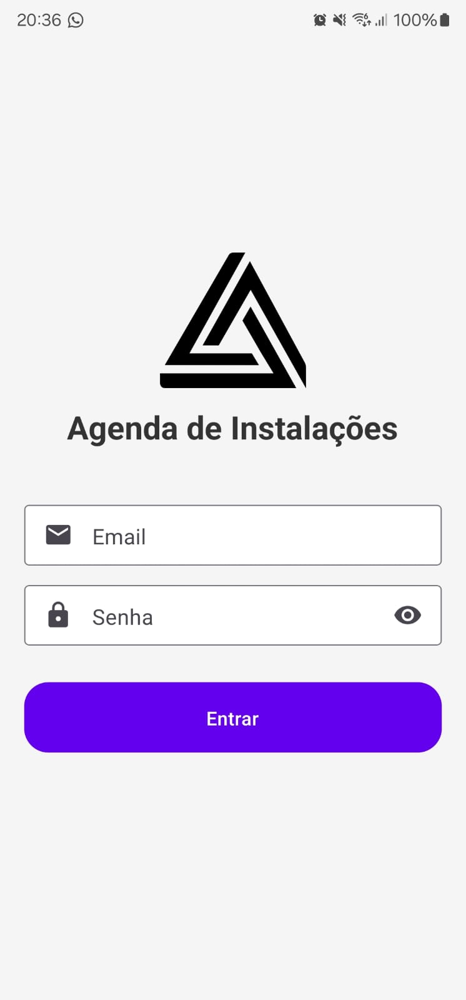
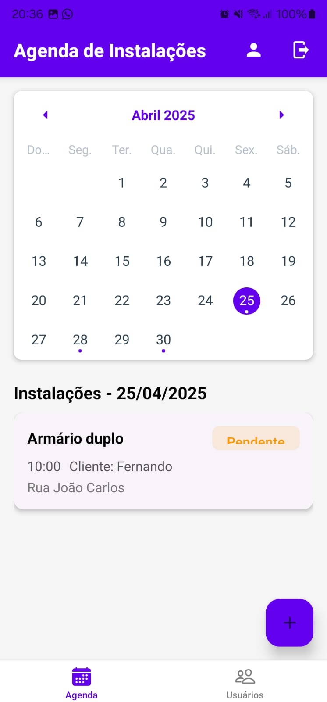
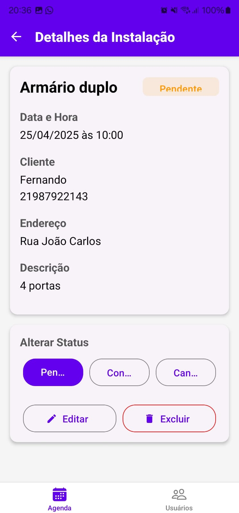
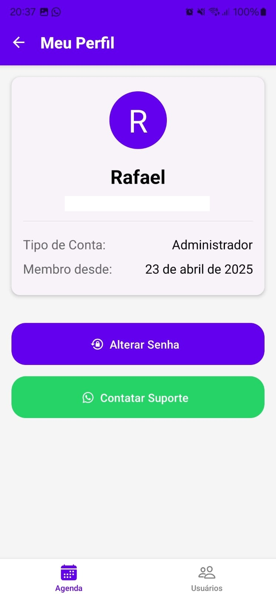

# Agenda de Instalações - Aplicativo Mobile

<p align="center">
  
</p>

Um aplicativo móvel para agendamento e gerenciamento de instalações, desenvolvido com React Native, Expo e Firebase. Permite que usuários visualizem, agendem e gerenciem instalações em um calendário interativo.

## 📱 Funcionalidades

### Autenticação
- Sistema de login seguro com email e senha
- Diferentes níveis de acesso (administrador e usuário comum)
- Recuperação de senha
- Animação de carregamento durante autenticação

### Calendário e Agendamento
- Visualização de instalações em formato de calendário
- Marcação visual de datas com instalações agendadas
- Listagem de instalações para a data selecionada
- Adição de novas instalações para datas específicas

### Gerenciamento de Usuários (Administradores)
- Listagem de todos os usuários cadastrados
- Adição de novos usuários
- Edição de informações de usuários existentes
- Definição de permissões (administrador ou usuário comum)

### Perfil de Usuário
- Visualização de informações do usuário
- Exibição da data de cadastro
- Alteração de senha
- Contato com suporte via WhatsApp

### Detalhes de Instalação
- Visualização detalhada de cada instalação
- Edição de informações da instalação
- Alteração de status (pendente, concluída, cancelada)
- Registro de informações adicionais

## 🛠️ Tecnologias Utilizadas

- **React Native**: Framework para desenvolvimento de aplicativos móveis multiplataforma
- **Expo**: Plataforma para simplificar o desenvolvimento React Native
- **TypeScript**: Superset tipado de JavaScript para desenvolvimento mais seguro
- **Firebase**:
  - **Authentication**: Para autenticação de usuários
  - **Firestore**: Banco de dados NoSQL para armazenamento de dados
- **React Navigation**: Navegação entre telas
- **React Native Paper**: Biblioteca de componentes UI
- **Formik**: Gerenciamento de formulários
- **Yup**: Validação de formulários
- **date-fns**: Manipulação e formatação de datas

## 📂 Estrutura do Projeto

```
src/
├── components/         # Componentes reutilizáveis
│   ├── Calendar.tsx    # Componente de calendário
│   ├── InstallationItem.tsx
│   ├── LoadingOverlay.tsx
│   └── ...
├── config/             # Configurações
│   └── firebase.ts     # Configuração do Firebase
├── contexts/           # Contextos React
│   └── AuthContext.tsx # Contexto de autenticação
├── hooks/              # Hooks personalizados
│   └── useAuth.ts      # Hook para acesso ao contexto de autenticação
├── navigation/         # Configuração de navegação
│   └── index.tsx       # Navegação principal
├── routes/             # Tipos de rotas
│   └── StackParamList.ts
├── screens/            # Telas do aplicativo
│   ├── Calendar/       # Tela de calendário e agendamento
│   ├── InstallationDetails/ # Detalhes da instalação
│   ├── Login/          # Tela de login
│   ├── Profile/        # Tela de perfil
│   └── UserManagement/ # Gerenciamento de usuários
└── services/           # Serviços e APIs
    ├── instalation.ts  # Serviços para instalações
    ├── profile.ts      # Serviços para perfil
    └── users.ts        # Serviços para usuários
```

## 🚀 Instalação e Uso

### Pré-requisitos
- Node.js (versão 14 ou superior)
- npm ou yarn
- Expo CLI
- Conta no Firebase

### Configuração do Firebase
1. Crie um projeto no [Firebase Console](https://console.firebase.google.com/)
2. Ative o Authentication e o Firestore Database
3. Configure as regras de segurança do Firestore
4. Obtenha as credenciais do projeto

### Instalação
1. Clone o repositório:
   ```bash
   git clone https://github.com/seu-usuario/agenda-instalacoes.git
   cd agenda-instalacoes
   ```

2. Instale as dependências:
   ```bash
   npm install
   # ou
   yarn install
   ```

3. Configure as credenciais do Firebase:
   - Crie um arquivo `src/config/firebase.ts` com suas credenciais:
   ```typescript
   import { initializeApp } from 'firebase/app';
   import { getAuth } from 'firebase/auth';
   import { getFirestore } from 'firebase/firestore';

   const firebaseConfig = {
     apiKey: "SUA_API_KEY",
     authDomain: "seu-projeto.firebaseapp.com",
     projectId: "seu-projeto",
     storageBucket: "seu-projeto.appspot.com",
     messagingSenderId: "SEU_MESSAGING_SENDER_ID",
     appId: "SEU_APP_ID"
   };

   const app = initializeApp(firebaseConfig);
   const auth = getAuth(app);
   const db = getFirestore(app);

   export { auth, db };
   ```

4. Inicie o aplicativo:
   ```bash
   expo start
   ```

5. Use o aplicativo Expo Go no seu dispositivo móvel para escanear o QR code ou execute em um emulador.

## 📊 Estrutura do Banco de Dados

### Coleção `users`
```
users/
├── [userId]/
    ├── name: string
    ├── email: string
    ├── isAdmin: boolean
    └── createdAt: timestamp
```

### Coleção `installations`
```
installations/
├── [installationId]/
    ├── title: string
    ├── description: string
    ├── client: string
    ├── address: string
    ├── date: timestamp
    ├── status: string ('pending', 'completed', 'cancelled')
    ├── createdBy: string (userId)
    └── createdAt: timestamp
```

## 🔒 Autenticação e Segurança

- Autenticação baseada em email e senha
- Diferentes níveis de acesso:
  - **Administradores**: Acesso completo a todas as funcionalidades
  - **Usuários**: Acesso limitado (sem gerenciamento de usuários)
- Regras de segurança no Firestore para controle de acesso aos dados

## 📱 Capturas de Tela

<p align="center">
  
  
  
  
</p>

## 🤝 Contribuição

Contribuições são bem-vindas! Sinta-se à vontade para abrir issues ou enviar pull requests.

1. Faça um fork do projeto
2. Crie sua branch de feature (`git checkout -b feature/nova-funcionalidade`)
3. Commit suas alterações (`git commit -m 'Adiciona nova funcionalidade'`)
4. Push para a branch (`git push origin feature/nova-funcionalidade`)
5. Abra um Pull Request

## 📄 Licença

Este projeto está licenciado sob a licença MIT - veja o arquivo [LICENSE](LICENSE) para detalhes.

## 📞 Contato

Para suporte ou dúvidas, entre em contato através do email:

- Email: 91rafaels@gmail.com

---

Desenvolvido com ❤️ usando React Native, Expo e Firebase.
